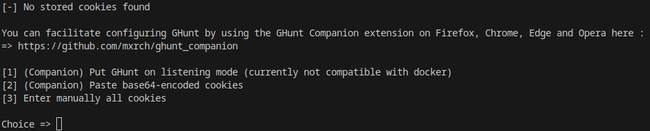
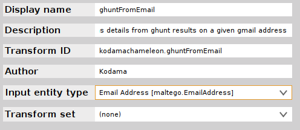
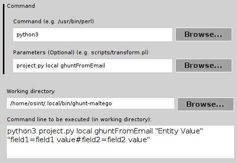
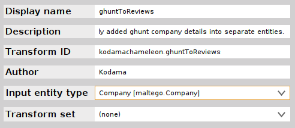
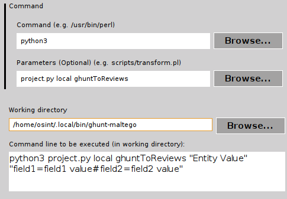
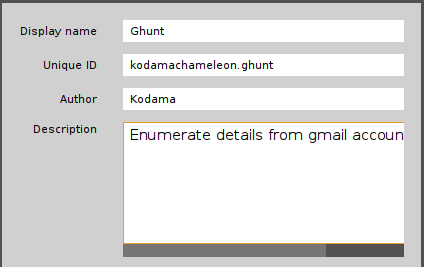

# Ghunt-Maltego
### Maltego Transform Partner to Ghunt 

[](https://www.python.org/)

Current Version: 1.0.0-beta 

Release Date: 2 June 2023

## 💎 About

Per their Github page, "[Ghunt (v2)](https://github.com/mxrch/GHunt) is an offensive Google framework, designed to evolve efficiently.
It's currently focused on OSINT, but any use related with Google is possible." Ghunt-Maltego utilizes the Ghunt python library to create Transforms in Maltego.

## 🎚️ Version
Ghunt-Maltego releases will be versioned using dotted triples, similar to [Semantic Version](http://semver.org/). For this specific document, we will refer to the respective components of this triple as <major>.<minor>.<patch>. The version number may have additional information, such as "-alpha.1", "-beta.2" to mark alpha and beta versions for earlier access. Such releases will be considered as "pre-releases".
   
| Version                          | Supported          |
|----------------------------------|--------------------| 
| Ghunt-Maltego 1.0.x              | :white_check_mark: |

## 🛠️ Setup
### Requirements
The following versions reflect the *known working* condition in which the project was developed and does not necessarily indicate a minimum standard.
- Maltego 4.3.0
- Python 3.11.2
   - maltego-trx 1.6.0
   - ghunt 2.0.3
   - geocoder 1.38.1
 - A Gmail Account
 - Ghunt Firefox/Google Companion (Optional)
   
### Installation
```
   cd ~/.local/bin
   git clone https://github.com/kodamaChameleon/ghunt-maltego.git
   cd ghunt-maltego
   python3 setup.py
```
Explanation:
1) Navigate to the default installation location for python packages (assumes Linux distribution)
2) Clone the git repository to your local workspace
3) Navigate to the ghunt-maltego directory
4) Launch the setup.py configuration script  
   a) Installs python dependencies (ghunt will be installed using pip to be used as a library)  
   b) Obtain google account login credentials  
   


At this point you have a couple of options for adding your credentials to ghunt. Perhaps the simplest method is to used the Ghunt Firefox or Google companion extension.
   
The extension is available on the following stores :\
\
[](https://addons.mozilla.org/en-US/firefox/addon/ghunt-companion/)&nbsp;&nbsp;&nbsp;[](https://chrome.google.com/webstore/detail/ghunt-companion/dpdcofblfbmmnikcbmmiakkclocadjab)
   
**Warning:** 🚨🚨🚨 It is fundamentally dangerous to provide your credentials to unfamiliar applications. Best practice here would be to create a separate gmail account used solely for the purpose of ghunt.

### Installing Local Transforms
1) In Maltego, select the Transforms tab and click *New Local Transform*


   

   
 2) Repeat the same process for the second transform
   
  
   
  
   
 3) If you want to combine the two transforms into an automated process, select the Machines tab and click *New Machine*
   
  
   
 4) In the *Machine Editor* window, copy and paste the contents from [ghunt.msl](./machines/ghunt.msl)
   
### 💡 Demo

  
   
##  ⚙️ Features
The following is a list of supported Ghunt data types.
   
| Data Type       | Supported  |Entity             |
|-----------------|------------|-------------------| 
| Full Name       | ✅         | maltego.Person    |
| Profile Photos  | ✅         | maltego.Image     |
| Cover Photos    | ❌         |                   |
| User Type       | ❌         |                   |
| Gaia ID         | ❌         |                   |
| Enabled Apps    | ✅         |maltego.Service    |
| Review Company  | ✅         |maltego.Company    |
| Review Rating   | ✅         |maltego.Sentiment  |
| Review Type     | ✅         |maltego.Industry   |
| Review Tag      | ✅         |maltego.hashtag    |
| Review Location | ✅         |maltego.Location   |
| Review Photos   | ❌         |                   |
   
*If a Ghunt feature isn't listed here, then it's probably not currently supported by ghunt-maltego.*
   
## 📜 License


[GNU General Public License v3.0](https://www.gnu.org/licenses/gpl-3.0.fr.html)
